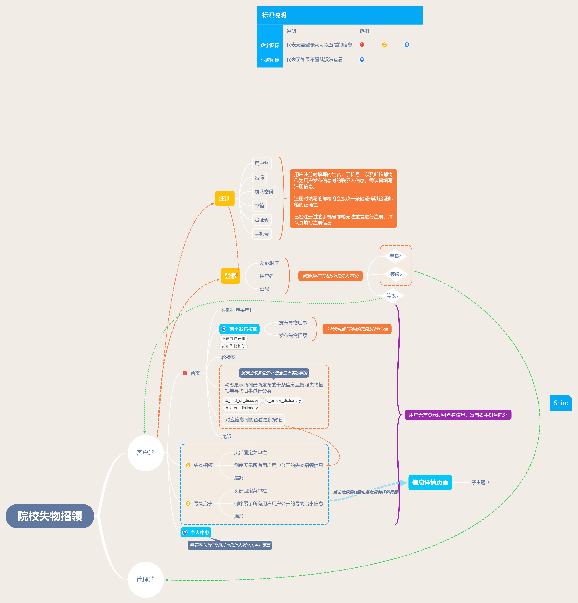

# 院校失物招领

## 产品定位：
    
    服务于某学院的失物招领网站

## 项目用到的相关技术、工具等
----------

开发平台及工具：Windows 10 | IDEA 2018.3

涉及的编程语言：Java  |  JavaScript  |  HTML

涉及的框架技术：Spring Boot  |  Spring  |   Speing MVC

其他技术：Maven | CSS  |  JQuery  |  Ajax  |  JSON  |  JSP  |  Servlet

数据库：MariaDB 10.4

服务器：Tomcat 8.x  |   JDK 1.8javajava

## 功能需求：

### 需求分析-展示
- 首页
  - top
    |--logo文字
    |-- （button） 首页 |  失物招领 | 寻物启事  |  个人中心
    |-- （button)       🔍发布寻物  💴发布招领
  - banner（可要可不要）
  - content
    |--失物招领模块     --寻物启事模块
    |-- 10条信息        --10条信息
    |--（序号 地域 信息标题  日期）
    |--查看更多（跳转到对用的失物/招领页面）
  - bottom
    |--友情链接
    |--Website from

- 失物招领
  - top
    |--logo文字
    |-- （button） 首页 |  失物招领 | 寻物启事  |  个人中心
  - content
    |--失物招领模块
    |--（图片、地域、信息标题）
    |--（发布时间yyyy-mm-dd）
    |--（信息类型：失物招领）
  - bottom
    |--友情链接
    |--Website from

- 寻物启事
  - top
    |--logo文字
    |-- （button） 首页 |  失物招领 | 寻物启事  |  个人中心
  - content
    |--寻物启事模块
    |--（图片、地域、信息标题）
    |--（发布时间yyyy-mm-dd）
    |--（信息类型：寻物启事）
  - bottom
    |--友情链接
    |--Website from

- 个人中心
  - top
    |--logo文字
    |-- （button） 首页 |  失物招领 | 寻物启事  |  个人中心
  - content
    |--个人信息展示模块
    |--（姓名、邮箱）
    |--修改名字 |   修改邮箱    |   修改密码（三个按钮都带有验证）
    |--我的寻物、招领信息模块
        |--标题 | 发表日期  |  操作
  - bottom
    |--友情链接
    |--Website from

- 详情界面（失物招领）
  - top
    |--logo文字
    |-- （button） 首页 |  失物招领 | 寻物启事  |  个人中心
  - content
    |--地域、信息标题
    |----信息详情
        |--联系电话：（拾者电话）
        |--物品种类：（证件）
        |--拾物地点：（校园某地）
        |--联系人员：（昵称或者姓名）
        |--发布时间：（yyyy-mm-dd）
        |--物品图片：
    
- 详情界面（寻物启事）
  - top
    |--logo文字
    |-- （button） 首页 |  失物招领 | 寻物启事  |  个人中心
  - content
    |--地域、信息标题
    |----信息详情
        |--联系电话：（失者电话）
        |--物品种类：（证件）
        |--丢失地点：（校园某地）
        |--联系人员：（昵称或者姓名）
        |--发布时间：（yyyy-mm-dd）
        |--物品图片：

### 需求分析-交互
- 按照功能排序
  - 按照（时间）顺序倒序排序

- 发布寻物信息
    |--（下拉框）、地点名称
  - 丢失地点
  - 丢失物品
    |--（下拉框）、物品名称
    丢失时间（点击选择日期）
    联系人
    电话
    标题
    上传图片“”
    确认发布

- 发布招领信息
  - 拾物地点
  - 拾到物品
    |--（下拉框）、物品名称
    拾物时间（点击选择日期）
    联系人
    电话
    标题
    上传图片“”
    确认发布

- 登陆页面
  - 手机号、邮箱
  - 密码
  - 返回首页
  - 免费注册

- 注册页面
  - 昵称
  - 密码
  - 确认密码
  - 邮箱
  - 验证码
  - 手机号
  - Designed by
  - 已有账号直接登陆
  - 返回首页

- 退出登录

### 需求分析-后台
- 对支持整站需要用到的数据，进行管理维护。比如类型管理，用户管理等等。
- 分类管理
  |--新增分类
  |--修改分类
  |--删除分类
- 用户管理
  - 对用户的账户进行注销
  - 对帐号进行状态修改（已冻结/未冻结）
- 信息管理
  - 展示所有信息
  - 可对违规信息做出删除处理
  - 顶部搜索框
  - 信息发布状态修改（已发布/未发布）

### 用户模块：

- 普通用户
  - 登录功能
  - 注册功能
  - 注销功能

- 信息发布（拦截未登录用户，登录后跳转到信息发布页面）
  - 寻物：发布寻物信息并进入待审核状态
  - 招领：发布招领信息并进入待审核状态
- 信息编辑
  - 寻物信息编辑：已登录用户编辑或者删除寻物信息
  - 招领信息编辑：已登录用户编辑或者删除招领信息
- 信息搜索
  - 地区搜索：根据地区进行搜索
  - 物品类型搜索：根据物品类型进行搜索
  - 关键字搜索：根据关键字进行搜索
- 信息举报（拦截未登录用户）
  - 普通用户可以举报其他用户发布的虚假信息等待管理员审批
- 提供线索
  - 普通用户可以查看物品信息并通过邮件的形式将线索信息发送给失主或者拾主

### 管理员模块：

- 管理员
  - 登陆功能
  - 注销功能
- 管理员审核发布信息
  - 审核通过则将信息分别显示在寻物或者招领页面
  - 审核不通过则将不通过信息发送给用户并要求其删除或者修改
- 管理员审批举报信息
  - 管理员审批举报信息判断是否合理，合理则通知发布信息的用户信息违规并删除，不和理则通知举报用户举报不通过
- 管理员发布公告
  - 管理员可以根据情况发布不同的公告在首页展示

[附件1](https://ActiveSoul8231.github.io/yxswzl/院校失物招领详细功能图1.pdf)
[附件2](https://ActiveSoul8231.github.io/yxswzl/院校失物招领详细功能图2.pdf)
